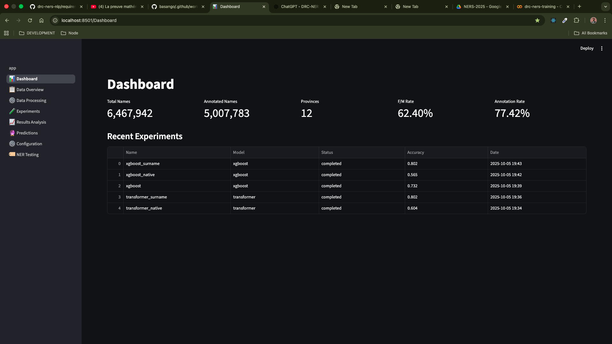

# A Culturally-Aware NLP System for Congolese Name Analysis and Gender Inference

[](https://github.com/bernard-ng/drc-ners-nlp/actions/workflows/audit.yml)
[](https://github.com/bernard-ng/drc-ners-nlp/actions/workflows/quality.yml)

---

Despite the growing success of gender inference models in Natural Language Processing (NLP), these tools often
underperform when applied to culturally diverse African contexts due to the lack of culturally-representative training
data.
This project introduces a comprehensive pipeline for Congolese name analysis with a large-scale dataset of over 5
million names from the Democratic Republic of Congo (DRC) annotated with gender and demographic metadata.

## Getting Started

### Installation & Setup

> download [the dataset](https://drive.google.com/file/d/1a5wQnOZdsRWBOeoMA_0lNtbneTvS9xqy/view?usp=drive_link), if you need access please reach us at mlec.academia@gmail.com. 

```bash
git clone https://github.com/bernard-ng/drc-ners-nlp.git

mkdir -p drc-ners-nlp/data/dataset
cp names.csv drc-ners-nlp/data/dataset

cd drc-ners-nlp
```

**Linux**
```bash
curl -LsSf https://astral.sh/uv/install.sh | sh

uv sync
```

**Macos & windows**
```bash
docker compose build
docker compose exec app bash
```

## Data Processing

This project includes a robust data processing pipeline designed to handle large datasets efficiently with batching,
checkpointing, and parallel processing capabilities.

**Pipeline Configuration**

```yaml
stages:
  - "data_cleaning"
  - "data_selection"
  - "feature_extraction"
  - "data_splitting"
```

**Running the Pipeline**

```bash
uv run ners pipeline run --env="production"
```

## Experiments

This project provides a modular experiment (model training and evaluation) framework for systematic model comparison and
research iteration. you can define model features, training parameters, and evaluation metrics in the `config/research_templates.yaml` file.

**Running Experiments**

```bash
# bigru
uv run ners research train --name="bigru" --type="baseline" --env="production"
uv run ners research train --name="bigru_native" --type="baseline" --env="production"
uv run ners research train --name="bigru_surname" --type="baseline" --env="production"
```

```bash
# cnn
uv run ners research train --name="cnn" --type="baseline" --env="production"
uv run ners research train --name="cnn_native" --type="baseline" --env="production"
uv run ners research train --name="cnn_surname" --type="baseline" --env="production"
```

```bash
# lightgbm
uv run ners research train --name="lightgbm" --type="baseline" --env="production"
uv run ners research train --name="lightgbm_native" --type="baseline" --env="production"
uv run ners research train --name="lightgbm_surname" --type="baseline" --env="production"
```

```bash
# logistic regression
uv run ners research train --name="logistic_regression" --type="baseline" --env="production"
uv run ners research train --name="logistic_regression_native" --type="baseline" --env="production"
uv run ners research train --name="logistic_regression_surname" --type="baseline" --env="production"
```

```bash
# lstm
uv run ners research train --name="lstm" --type="baseline" --env="production"
uv run ners research train --name="lstm_native" --type="baseline" --env="production"
uv run ners research train --name="lstm_surname" --type="baseline" --env="production"
```

```bash
# random forest
uv run ners research train --name="random_forest" --type="baseline" --env="production"
uv run ners research train --name="random_forest_native" --type="baseline" --env="production"
uv run ners research train --name="random_forest_surname" --type="baseline" --env="production"
```

```bash
# naive bayes
uv run ners research train --name="naive_bayes" --type="baseline" --env="production"
uv run ners research train --name="naive_bayes_native" --type="baseline" --env="production"
uv run ners research train --name="naive_bayes_surname" --type="baseline" --env="production"
```

```bash
# transformer
uv run ners research train --name="transformer" --type="baseline" --env="production"
uv run ners research train --name="transformer_native" --type="baseline" --env="production"
uv run ners research train --name="transformer_surname" --type="baseline" --env="production"
```

```bash
# xgboost
uv run ners research train --name="xgboost" --type="baseline" --env="production"
uv run ners research train --name="xgboost_native" --type="baseline" --env="production"
uv run ners research train --name="xgboost_surname" --type="baseline" --env="production"
```

## Web Interface

This project includes a user-friendly web interface built with Streamlit, allowing non-technical users to run
experiments and make predictions without needing to understand the underlying code.

### Running the Web Interface



```bash
uv run ners web run --env="production"
```

```bash
docker compose run --rm --service-ports app ners web run --env=production
```

then open : http://localhost:8501/

## Contributors

<a href="https://github.com/bernard-ng/drc-ners-nlp/graphs/contributors" title="show all contributors">
  
</a>

## Acknowledgements
- Map Visualization: [https://data.humdata.org/dataset/anciennes-provinces-rdc-old-provinces-drc](https://data.humdata.org/dataset/anciennes-provinces-rdc-old-provinces-drc)
