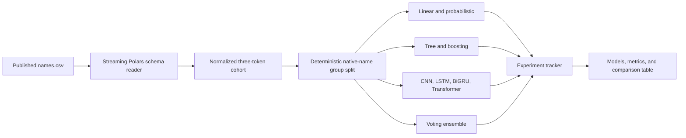

# CongoNames full-name sex classification study

[](https://github.com/bernard-ng/drc-ners-nlp/actions/workflows/audit.yml)
[](https://github.com/bernard-ng/drc-ners-nlp/actions/workflows/quality.yml)

This repository compares models that predict sex from full names in the published
[CongoNames corpus](https://doi.org/10.5281/zenodo.19809985). Corpus acquisition,
PDF extraction, normalization, dataset preparation, LLM annotation, and spaCy NER belong
to the corpus project and are intentionally outside this repository.

## Terminology

Throughout this project, "sex" means the `m` or `f` marker recorded in the source
examination data. It does not mean gender identity. The code and documentation use "sex"
with this definition.

## Dataset contract

Place the published file at:

```text
data/dataset/names.csv
```

Only these columns are read:

| Column | Meaning |
| --- | --- |
| `name` | Normalized full candidate name |
| `sex` | Source-record sex, `m` or `f` |

The published provenance columns may remain in the CSV; training ignores them. The loader
skips empty names in memory because they have no usable model input. It rejects labels
outside `m`/`f`, does not write a cleaned dataset, and leaves the source file untracked.

## Research architecture


```mermaid
flowchart LR
    A[Published names.csv] --> B[Streaming Polars schema reader]
    B --> C[Normalized three-token cohort]
    C --> D[Deterministic native-name group split]
    D --> E1[Linear and probabilistic]
    D --> E2[Tree and boosting]
    D --> E3[CNN, LSTM, BiGRU, Transformer]
    D --> E4[Voting ensemble]
    E1 --> F[Experiment tracker]
    E2 --> F
    E3 --> F
    E4 --> F
    F --> G[Models, metrics, and comparison table]
```

The study compares these models:

| Family | Models |
| --- | --- |
| Control | Majority-class dummy |
| Linear/probabilistic | Logistic regression, position-aware logistic regression, multinomial Naive Bayes |
| Tree/boosting | Random forest, LightGBM, XGBoost |
| Neural sequence | CNN, bidirectional LSTM, bidirectional GRU, Transformer |
| Ensemble | Soft-voting logistic regression, random forest, and Naive Bayes |

`ners.research` loads experiment templates, creates registered models, saves artifacts,
and compares metrics. Every model receives only the published `name` and `sex` columns.

The controlled surname ablation keeps model comparisons consistent:

- Polars streams projected CSV columns in bounded batches.
- It selects exactly three-token names, defines the first two tokens as the native view,
  and compares that sequence with the surname-included three-token sequence.
- A stable hash assigns every occurrence of the same first-two-token native name to one
  split. Different full names that collapse to the same native-only input therefore cannot
  leak between training and evaluation.
- `ExperimentDatasetStore` builds train and test partitions in one CSV pass, then reuses
  the same in-memory split for every model in the suite.
- Every architecture receives the same deterministic sample and held-out groups.
- Logistic regression max-absolute-scales sparse character counts so SAGA converges without
  densifying the feature matrix.
- Classical models keep character matrices sparse. The boosting and forest templates cap
  TF-IDF at 4,096 features instead of integer-encoding unique names.
- All neural models operate on characters with a 32-position limit. This avoids an
  extremely large long-tail word vocabulary and generalizes to unseen name tokens.
- Neural validation and optional cross-validation group by the first two tokens. Neural
  fits use class weights, early stopping, and best-weight restoration.
- Cross-validation is off by default because it repeats training for each fold. When
  enabled, it refits preprocessing within stratified native-name groups.
- The loader does not write sampled or prepared CSV files.

## Setup and training

`uv sync` creates the local environment. The project has no Docker files.

```bash
uv sync
```

List the configured models and their local dependency status:

```bash
uv run ners research list
```

Run one architecture on the deterministic one-percent study sample:

```bash
uv run ners research train --name logistic_regression --sample-fraction 0.01
```

Run every locally available architecture on exactly the same sample and split:

```bash
uv run ners research suite --sample-fraction 0.01
```

Run the primary full-versus-native comparison for the strongest linear candidates:

```bash
uv run ners research compare-views \
  --name logistic_regression \
  --name position_logistic_regression \
  --sample-fraction 0.01
```

Omit `--name` to compare every locally available architecture. The command reports the
full-minus-native metric deltas as `surname_gain` and records the view, three-token cohort,
and native grouping key with every model artifact.

### Initial one-percent result

On 46,193 training and 12,207 held-out three-token records, position-aware logistic
regression reached 0.9205 macro-F1 with the surname included and 0.6400 with native tokens
only. Standard character logistic regression reached 0.9088 and 0.6236. The resulting
macro-F1 gains of 0.2804 and 0.2853 strongly support the surname-influence hypothesis on
this development sample. The majority-class control achieved 0.3712 macro-F1, so the
native-only models still learn meaningful signal. See [MODEL.md](MODEL.md) for the full
metric table, corpus audit, and experimental contract.

Across all locally available classical models, position-aware logistic regression is best
in both views. LightGBM is the nearest full-name alternative at 0.9093 macro-F1 and Naive
Bayes is the nearest native-only baseline at 0.6293. Random forest, XGBoost, and the voting
ensemble add compute without improving on the position-aware linear model.

### Local experiment interface

Launch the local research app:

```bash
uv run ners web
```

The Experiments tab compares tracked metrics and reports missing model dependencies. Run
experiment trains one template at a time. Results shows metrics, confusion matrices, and
the feature score recorded by each estimator. Dataset reads `names.csv` without changing
it and shows schema checks, sex counts, and an optional 20-row preview. The app has no
acquisition, annotation, normalization, preparation, editing, or dataset export actions.
Close the local server with `Ctrl+C`.

`config/research_templates.yaml` defines the experiments. The tracker writes results and
models under:

```text
data/outputs/experiments/
data/models/experiments/
```

`uv sync` installs TensorFlow only on Linux x86_64, as specified in `pyproject.toml`. On
other systems, the registry still lists the neural models and reports that TensorFlow is
missing. The suite skips those models. LightGBM and XGBoost need an OpenMP runtime. Install
it on macOS with `brew install libomp`; the registry checks the native library before a run.

To train a full-corpus linear baseline without holding the complete feature matrix in
memory, run:

```bash
uv run ners train
```

It uses hashed character n-grams and `SGDClassifier.partial_fit`, producing the default
`data/models/reported-sex-classifier.joblib` artifact.

## Code organization and public API

Import configuration from `ners.config` and shared hashing, JSON, runtime, and name helpers
from `ners.utils`. `ners.research` contains dataset loading, experiment tracking, model
registration, model classes, and reporting. Import only the package APIs shown below;
internal module paths may change.

Application code uses these imports:

```python
from ners import NameDataset, NameSexClassifier, train_model
from ners.config import ExperimentConfig, ResearchConfig, TrainingConfig
from ners.research import (
    MODEL_REGISTRY,
    ExperimentBuilder,
    ExperimentRunner,
)
```

`MODEL_REGISTRY` imports TensorFlow, LightGBM, or XGBoost only when a run selects that
model. Experiment comparisons and exports return Polars dataframes. Estimators receive
NumPy arrays or sparse matrices only where their libraries require them.

## Evaluation and prediction

Re-run evaluation with the split stored in the model artifact:

```bash
uv run ners evaluate
```

Predict one or more quoted full names:

```bash
uv run ners predict "ilunga ngoy jean" "kavira mapendo esther"
```

The command prints JSON with `sex` and `confidence` fields. Treat both as estimates of the
source dataset label.

## Quality checks

```bash
uv run pytest
uv run ruff check .
uv run ruff format --check .
uv run pyright
```

## Responsible use

The corpus represents secondary-school examination candidates and has coverage,
demographic, temporal, and extraction biases. Do not use this model to determine gender
identity, profile people, reconstruct identities, or make eligibility, employment, credit,
health, surveillance, or other consequential decisions. Research reports should state that
sex comes from the source records and should document uncertainty and subgroup limitations.
