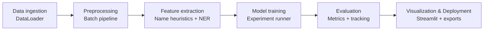

# Technical Architecture Report: DRC NERS NLP

## Project Overview
The DRC NERS NLP project delivers an end-to-end system for Congolese name analysis and gender inference backed by a 5-million-record dataset enriched with demographic metadata.【F:README.md†L1-L12】 The toolkit wraps a configurable processing pipeline, experiment runner, and Streamlit dashboard so that researchers and practitioners can reproducibly clean raw registry data, engineer features, benchmark multiple models, and publish insights without modifying core code.

## Software Architecture and Implementation

### Configuration-driven Orchestration
* **Central config management** – `ConfigManager` resolves layered YAML/JSON configs, injects project paths, and merges environment overrides, ensuring every workflow can be replayed with the same parameters.【F:src/ners/core/config/config_manager.py†L12-L157】
* **Pipeline definition** – `PipelineConfig` captures stage order, batch settings, annotation parameters, and dataset splits. The default `pipeline.yaml` enumerates every stage and shared directories, creating a single source of truth for the runbook.【F:src/ners/core/config/pipeline_config.py†L10-L29】【F:config/pipeline.yaml†L1-L68】
* **Research templates** – Pre-built experiment templates map feature sets and hyperparameters for each baseline architecture, allowing experiments to be reproduced or extended declaratively.【F:config/research_templates.yaml†L1-L86】

### Modular Data Pipeline
1. **Data ingestion** – `DataLoader` streams CSV chunks with typed columns, optional balancing, and dataset size limits; it also writes artifacts using consistent encodings for downstream reuse.【F:src/ners/core/utils/data_loader.py†L33-L174】
2. **Batch processing engine** – The `Pipeline` class wires ordered steps and delegates to a `BatchProcessor` that supports sequential or concurrent execution, checkpointing, and memory-aware concatenation via `MemoryMonitor` to handle multi-million row datasets safely.【F:src/ners/processing/pipeline.py†L12-L57】【F:src/ners/processing/batch/batch_processor.py†L12-L173】【F:src/ners/processing/batch/memory_monitor.py†L7-L25】
3. **Preprocessing steps** –
   * `DataCleaningStep` drops critical nulls, normalizes text, and deduplicates records.【F:src/ners/processing/steps/data_cleaning_step.py†L10-L31】
   * `FeatureExtractionStep` engineers linguistic statistics, name segments, gender/category inference, region mapping, and spaCy-based tagging while optimizing dtypes to keep memory usage low.【F:src/ners/processing/steps/feature_extraction_step.py†L24-L196】
   * `DataSelectionStep` enforces column whitelists and domain-specific filters (e.g., removing “global” regions for certain years).【F:src/ners/processing/steps/data_selection_step.py†L9-L60】
   * `NERAnnotationStep` loads a spaCy model, parallelizes tagging with retries, and records provenance for each batch.【F:src/ners/processing/steps/ner_annotation_step.py†L13-L172】
   * `LLMAnnotationStep` calls an Ollama-hosted model with configurable concurrency, rate limiting, and exponential backoff to enrich unannotated rows while maintaining checkpoints.【F:src/ners/processing/steps/llm_annotation_step.py†L18-L169】
   * `DataSplittingStep` persists evaluation, gender, and province-specific splits in deterministic fashion, reusing the shared data loader for consistent I/O.【F:src/ners/processing/steps/data_splitting_step.py†L11-L69】
4. **Pipeline runner** – `run_pipeline` composes the configured steps, captures progress metrics, and invokes the splitter to materialize curated datasets, turning raw CSVs into model-ready corpora with a single command.【F:src/ners/main.py†L14-L75】
5. **Operational visibility** – `PipelineMonitor` inspects checkpoint state, estimates storage use, and exposes Typer commands for status, cleanup, or reset, simplifying long-running batch management.【F:src/ners/processing/monitoring/pipeline_monitor.py†L11-L196】【F:src/ners/cli.py†L156-L200】

### Research Experimentation Pipeline
* **CLI and templates** – Typer-powered commands load configuration environments and instantiate experiments from templates, guaranteeing every run is traceable to a versioned config file.【F:src/ners/cli.py†L13-L146】
* **Experiment runner** – `ExperimentRunner` fetches the featured dataset, applies filters, splits data, trains models from the registry, computes metrics, confusion matrices, and feature importance, then persists joblib artifacts per run.【F:src/ners/research/experiment/experiment_runner.py†L24-L271】
* **Model registry and abstractions** – Traditional, neural, and ensemble estimators inherit from `BaseModel`, which standardizes feature extraction, training, persistence, and probability interfaces. For example, the logistic regression model couples a character n-gram vectorizer with solver-specific tuning guidance.【F:src/ners/research/base_model.py†L15-L210】【F:src/ners/research/models/logistic_regression_model.py†L1-L47】
* **Tracking and artifact management** – `ExperimentTracker` records metadata, metrics, and tags in JSON for comparison/export, while `ModelTrainer` orchestrates runs, saves serialized models/configs, and generates learning curves for later visualization or deployment.【F:src/ners/research/experiment/experiment_tracker.py†L14-L200】【F:src/ners/research/model_trainer.py†L16-L200】

### Visualization and User Interfaces
* **Streamlit portal** – `ners.web.app` bootstraps a Streamlit dashboard that shares the same configuration stack, giving analysts access to pipeline monitors, experiment summaries, and predictions through a browser-friendly UI.【F:src/ners/web/app.py†L1-L67】
* **Analysis utilities** – The statistics package offers reusable seaborn/matplotlib plots (e.g., transition matrices, letter frequency charts) for exploratory studies, exporting intermediate CSVs alongside visuals.【F:src/ners/research/statistics/plots.py†L1-L39】

## Technology Stack and Environments
* **Core languages & libraries** – Python 3.11 orchestrated by the `uv` package manager, with heavy use of pandas, NumPy, scikit-learn, joblib, spaCy, Streamlit, seaborn, and Typer across modules.【F:Dockerfile†L3-L48】【F:src/ners/research/experiment/experiment_runner.py†L6-L21】
* **LLM integration** – The LLM annotation step leverages the Ollama client, optional rate limiting, and JSON-schema validation to keep third-party inference reproducible and auditable.【F:src/ners/processing/steps/llm_annotation_step.py†L21-L116】
* **Containerization** – The Dockerfile provisions a slim Debian image with reproducible uv-managed environments, while `compose.yml` mounts configs/data and exposes Streamlit, providing parity between local and deployment setups.【F:Dockerfile†L3-L48】【F:compose.yml†L1-L23】

## Reproducibility and Automation
* All entry points (`ners pipeline`, `ners ner`, `ners research`, `ners monitor`) source environment-specific configs and return exit codes, enabling CI/CD and scheduled jobs to orchestrate pipelines reliably.【F:src/ners/cli.py†L13-L200】
* Version-controlled configs cover pipeline stages, annotations, prompts, and experiment templates; `ConfigManager` ensures default paths map to versioned `data/`, `models/`, and `outputs/` directories for each run.【F:src/ners/core/config/config_manager.py†L15-L111】【F:config/pipeline.yaml†L1-L68】
* Experiment artifacts (models, metrics, learning curves, exports) are stored per experiment ID with timestamps and hashes, easing regression comparisons and rollbacks.【F:src/ners/research/experiment/experiment_tracker.py†L45-L163】【F:src/ners/research/model_trainer.py†L109-L200】

## Scalability and Performance Considerations
* Chunked reads, optimized dtypes, and optional stratified sampling keep ingestion memory-efficient even for multi-million row CSVs.【F:src/ners/core/utils/data_loader.py†L40-L161】
* Batch processing supports threaded or multiprocess execution with incremental checkpointing, enabling restarts mid-run and reducing wasted computation on failure.【F:src/ners/processing/batch/batch_processor.py†L29-L156】
* Memory monitoring and dtype normalization inside feature engineering prevent ballooning DataFrame footprints during annotation-heavy stages.【F:src/ners/processing/steps/feature_extraction_step.py†L53-L195】【F:src/ners/processing/batch/memory_monitor.py†L7-L25】
* Rate-limited concurrency in NER and LLM steps balances throughput with external service stability, retrying transient failures without blocking the whole run.【F:src/ners/processing/steps/ner_annotation_step.py†L50-L166】【F:src/ners/processing/steps/llm_annotation_step.py†L58-L163】

## Deployment and Interfaces
* **Command-line workflows** – The Typer CLI exposes discrete subcommands for pipeline execution, NER dataset generation, research training, and checkpoint maintenance, simplifying automation scripts and developer onboarding.【F:src/ners/cli.py†L13-L200】
* **Web interface** – Streamlit shares the same configuration context as the CLI and surfaces monitoring utilities, experiment tracking, and interactive analysis for non-technical stakeholders.【F:src/ners/web/app.py†L1-L67】
* **Containerized services** – Docker Compose binds the CLI, configs, and data directories into a reproducible container, standardizing environment setup across OSes and enabling GPU-enabled hosts to mount device-specific resources if needed.【F:compose.yml†L1-L23】

## Summary of Design Choices
* Configuration-first design separates code from experiment definitions, allowing fast iteration without code changes.【F:src/ners/core/config/config_manager.py†L15-L157】【F:config/research_templates.yaml†L1-L86】
* Batch checkpoints, memory monitoring, and rate limiting deliver resilience against large-scale processing failures and external service hiccups.【F:src/ners/processing/batch/batch_processor.py†L29-L173】【F:src/ners/processing/steps/llm_annotation_step.py†L21-L169】
* Unified model abstractions, experiment tracking, and artifact exports make the research stack extensible and production-ready, with metrics and models stored alongside configuration for reproducible science.【F:src/ners/research/base_model.py†L15-L210】【F:src/ners/research/experiment/experiment_tracker.py†L14-L200】
* Streamlit dashboards and Typer commands democratize access, letting analysts trigger pipelines or inspect experiments without touching Python modules.【F:src/ners/cli.py†L13-L200】【F:src/ners/web/app.py†L1-L67】

By combining configuration-driven orchestration, modular batch processing, and standardized experiment tooling, the DRC NERS NLP project functions as a robust, reproducible pipeline capable of scaling from exploratory research to production-ready deployments.
